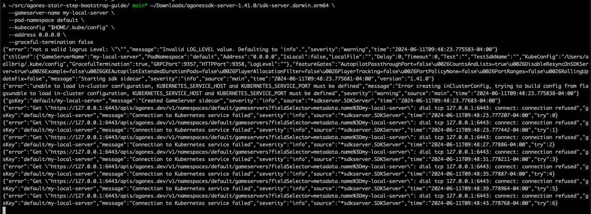
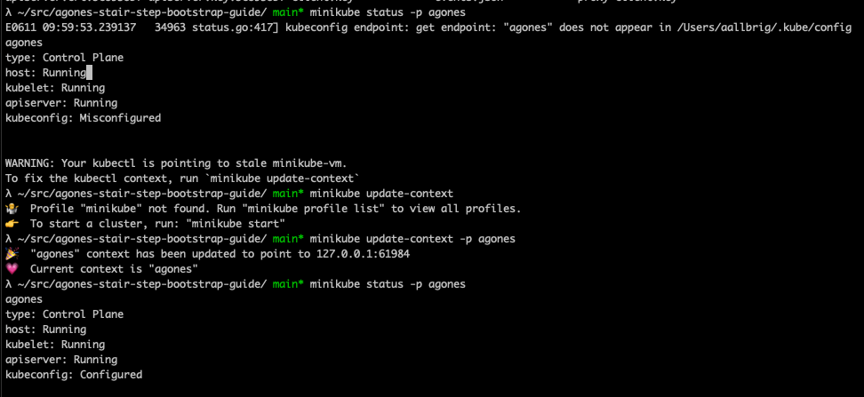
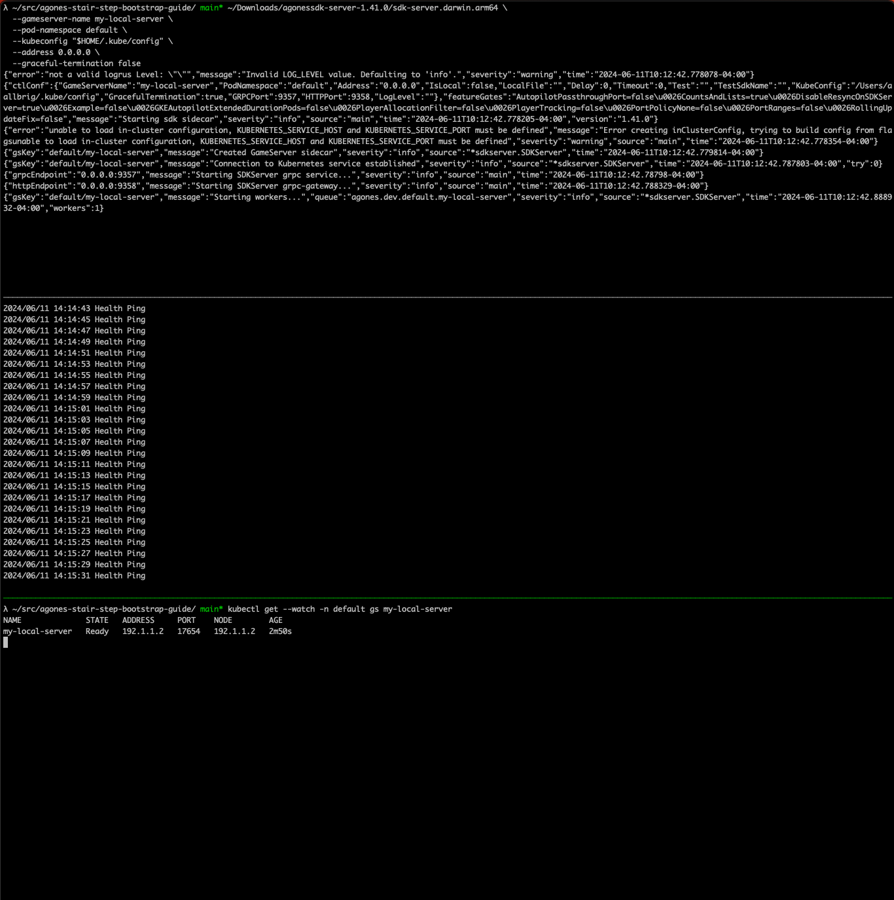
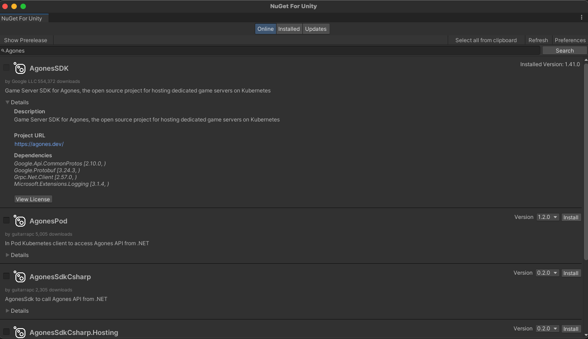
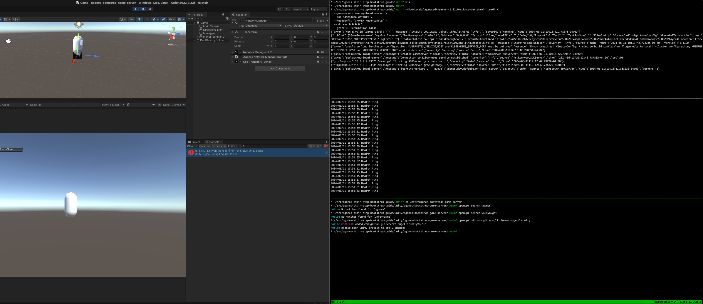
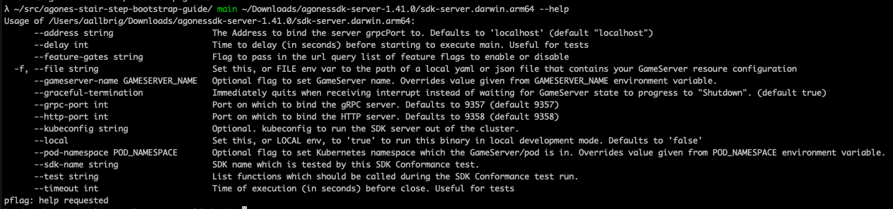
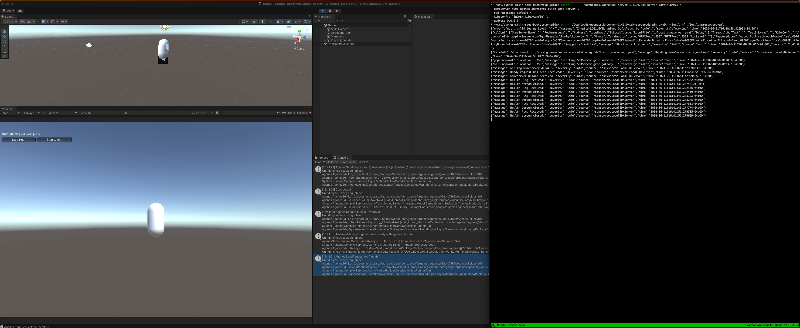

## June 11th 2024
The goal for today is to use the [Agones local development guide](https://agones.dev/site/docs/guides/client-sdks/local/) to _get something going_ locally in my unity editor. Since my UnityNuGet issue/PR are still in flight, the plan is to manually download C# Agone Game Server Client SDK directly from [its NuGet package location](https://www.nuget.org/packages/AgonesSDK) into a newly created unity project. I find it nice that one can get started developing without having to have a kubernetes cluster in the mix, at least yet.

The local dev guide has a download link for the agonessdk-server, but looks like its the same as what can be found in googleforgames/agones (link to [1.41.0 release](https://github.com/googleforgames/agones/releases/tag/v1.41.0)). Just for giggles here's the command sequence one can run to download into `~/Downloads` folder using `gh`:
```bash
zip_url=$(gh release view --repo googleforgames/agones --json assets --jq '.assets[] | select(.name | contains("agonessdk-server-")) | .url')
zip_name=$(basename $zip_url)
unzip_folder_name=$(basename $zip_name .zip)
curl -L $zip_url -o $HOME/Downloads/$zip_name
unzip $HOME/Downloads/$zip_name -d $HOME/Downloads/$unzip_folder_name
```
__Note: you can use `gh release list --repo googleforgames/agones` to view all releases using GitHub cli__

For me on my M2 MBP I can now start the server using `~/Downloads/agonessdk-server-1.41.0/sdk-server.darwin.arm64 --local` command.


The guide spells out a couple `curl` commands to interact with the Agones process:
```bash
# Indicate ready
curl -X POST "http://localhost:9358/ready" -H "accept: application/json" -H "Content-Type: application/json" -d "{}"
# Get game servers that are ready
curl -GET "http://localhost:9358/gameserver" -H "accept: application/json"
# Add in labels to game server metadata
curl -X PUT "http://localhost:9358/metadata/label" -H "accept: application/json" -H "Content-Type: application/json" -d "{ \"key\": \"foo\", \"value\": \"bar\"}"
curl -GET "http://localhost:9358/gameserver" -H "accept: application/json"
```

I think with that (+ skipping ths discussion about running the server binary in a container, discussion about docker compose, and discussion about running Agones directly from source(!!!)), I think I'm ready to graduate to the next guide in the Next Steps: [Out of Cluster Dev Server](https://agones.dev/site/docs/advanced/out-of-cluster-dev-server/).

> Running an “out of cluster” dev server combines the best parts of local debugging and being a part of a cluster. A developer will be able to run a custom server binary on their local machine, even within an IDE with breakpoints. The server would also be allocatable within a cluster, allowing integration with the project’s full stack for handling game server lifetime.

Music to my ears. I'm very relieved thought has been put into the local dev experience, as that represents the initial steps a dev takes when onboarding onto a platform/framework/library.

---

Hmm, after reading a little more perhaps it isn't 100% possible to get an MVP running locally without a kubernetes cluster. Going to start minikube.

```bash
# Create new k8s cluster and install agones
minikube start --kubernetes-version v1.28.6 -p agones
helm repo add agones https://agones.dev/chart/stable
helm repo update
helm install my-release --namespace agones-system --create-namespace agones/agones
# create a simple game server
kubectl create -f https://raw.githubusercontent.com/googleforgames/agones/release-1.41.0/examples/simple-game-server/gameserver.yaml
```

Now I can run the SDK server binary as such:
```bash
~/Downloads/agonessdk-server-1.41.0/sdk-server.darwin.arm64 \
  --gameserver-name my-local-server \
  --pod-namespace default \
  --kubeconfig "$HOME/.kube/config" \
  --address 0.0.0.0 \
  --graceful-termination false
```

Hmm, I'm getting a lot of `Connection to Kubernetes service failed`... I wonder why.



Search for error in Agones github repo reveals where in source code this fires off from (https://github.com/search?q=repo%3Agoogleforgames%2Fagones+%22Connection+to+Kubernetes+service+failed%22&type=code). There aren't issues with this mentioned.

Based on the error, maybe something is up with minikube? Ah yes, appears so.



Now I'm getting a different error: `{"error":"could not retrieve GameServer default/my-local-server: gameserver.agones.dev \"my-local-server\" not found","message":"Could not run sidecar","severity":"fatal","source":"main","time":"2024-06-11T10:04:47.790125-04:00"}`; need to add the GameServer YAML from [Local Game Server Guide #Register your server with Agones](https://agones.dev/site/docs/guides/local-game-server/). 

```bash
kubectl apply -f - <<EOF
apiVersion: "agones.dev/v1"
kind: GameServer
metadata:
  name: my-local-server
  annotations:
    # Causes Agones to register your local game server at 192.1.1.2, replace with your server's IP address.
    agones.dev/dev-address: "192.1.1.2"
spec:
  ports:
  - name: default
    portPolicy: Static
    hostPort: 17654
    containerPort: 17654
  # The following is ignored but required due to validation.
  template:
    spec:
      containers:
      - name: simple-game-server
        image: us-docker.pkg.dev/agones-images/examples/simple-game-server:0.32
EOF
```
__I recognize that I'll probably want to change `agones.dev/dev-address` to `127.0.0.1` since my game server process will be running locally inside Unity Editor and `host/container` port to `7777` as that's the default UDP port my netcode library of choice (Mirror) uses, but I'll keep the snippet as is for now.__

Cool, that moves me past the error above. Not 100% sure what I'm seeing but at least I'm seeing stuff happen!



I think I'm ready to start a new unity project and install the Agone C# Game Server Client SDK...

---

But first, going to follow up on [xoofx/UnityNuGet PR#376](https://github.com/xoofx/UnityNuGet/pull/376) because the build failed.
```text
The package `AgonesSDK.1.0.2` has a dependency on `Google.Api.CommonProtos` which is not in the registry. You must add this dependency to the registry.json file.
The package `AgonesSDK.1.0.2` has a dependency on `Grpc` which is not in the registry. You must add this dependency to the registry.json file.
...
```

Just need to add those dependencies to the `registry.json` file.
- https://www.nuget.org/packages/Google.Api.CommonProtos
- https://www.nuget.org/packages/Grpc

Cool, ready to move on.

---
New Unity project
```bash
mkdir -p unity
latest_unity_editor=$(ls -d /Applications/Unity/Hub/Editor/* | sort -V | tail -n 1)
"${latest_unity_editor}/Unity.app/Contents/MacOS/Unity" -createProject $(pwd)/unity/agones-bootstrap-game-server
curl https://raw.githubusercontent.com/github/gitignore/main/Unity.gitignore -o unity/agones-bootstrap-game-server/.gitignore
```

Get AgonesSDK using GlitchEnzo/NuGetForUnity (easier than curl/unzip/mv to Assets/Plugin and manually reconciling dependencies)
```bash
npm install -g openupm-cli
cd unity/agones-bootstrap-game-server
openupm add com.github-glitchenzo.nugetforunity
```


---

Added Mirror, created new network manager and am now referencing the [AgonesSDK C# guide](https://agones.dev/site/docs/guides/client-sdks/csharp/). First thing I noticed was the `agones.ConnectAsync()` is deprecated but the docs don't mention. Opened PR to address in documentation: https://github.com/googleforgames/agones/pull/3866

---

Haven't gotten the Agones Game Server C# SDK to talk to the running SDK Server quite yet. I'm sure I'll have to futz around more to get it all connected.

---

I purposefully did not use Agones correctly. This is because I was exploring the guides that were presented to me. I should fix this.



- Running SDK Server in top window of terminal
  ```bash
  ~/Downloads/agonessdk-server-1.41.0/sdk-server.darwin.arm64 \
    --gameserver-name my-local-server \
    --pod-namespace default \
    --kubeconfig "$HOME/.kube/config" \
    --address 0.0.0.0 \
    --graceful-termination false
  ```
- Running container image of simple game server
  ```bash
  docker run --rm --network="host" us-docker.pkg.dev/agones-images/examples/simple-game-server:0.32
  ```
- Unity Editor contains running game server process when played.
  
  The issue I'm facing right now with my game server is when my `Mirror.NetworkManager` runs it's authoritative on server start/stop my current use of the AgonesSDK C# client sdk is not able to connect to the "SDK Server" running as a standalone process.

  ```text
  NetworkManager | non-ok status: Unavailable
  UnityEngine.Debug:LogError (object)
  AgonesNetworkManager/<ReadyForPlayers>d__3:MoveNext () (at Assets/Scripts/AgonesNetworkManager.cs:27)
  System.Runtime.CompilerServices.AsyncTaskMethodBuilder`1<Grpc.Core.Status>:SetResult (Grpc.Core.Status)
  Agones.AgonesSDK/<ReadyAsync>d__32:MoveNext ()
  UnityEngine.UnitySynchronizationContext:ExecuteTasks () (at /Users/bokken/build/output/unity/unity/Runtime/Export/Scripting/UnitySynchronizationContext.cs:107)
  ```

  ```text
  NetworkManager | details: Error starting gRPC call. HttpRequestException: An error occurred while sending the request. IOException: Unable to read data from the transport connection: Connection reset by peer. SocketException: Connection reset by peer
  UnityEngine.Debug:LogError (object)
  AgonesNetworkManager/<ReadyForPlayers>d__3:MoveNext () (at Assets/Scripts/AgonesNetworkManager.cs:28)
  System.Runtime.CompilerServices.AsyncTaskMethodBuilder`1<Grpc.Core.Status>:SetResult (Grpc.Core.Status)
  Agones.AgonesSDK/<ReadyAsync>d__32:MoveNext ()
  UnityEngine.UnitySynchronizationContext:ExecuteTasks () (at /Users/bokken/build/output/unity/unity/Runtime/Export/Scripting/UnitySynchronizationContext.cs:107)
  ```

Things I can try
- Restart the SDK Server process as `--local` to enable connection
- Update the `GameServer` CRD to point to `127.0.0.1` instead of what value I left it at
- Debug follow the execution of `AgonesSDK.ReadyAsync` to see what happens. Answer questions...
    - What connection values are being used?
    - Is there a service instance running where it thinks it should be connecting to?
- Reread guides



SDK server help output shows by default there's a grpc service on localhost:9357 and an http service on localhost:9358.

I'm surprised `curl -X POST "http://localhost:9358/ready" -H "accept: application/json" -H "Content-Type: application/json" -d "{}"` has no problem interacting with the running sdk server but not through AgonesSDK.ReadyAsync().

---

Oh my... I've been using the generic C# SDK. There's an SDK specific to clients. https://agones.dev/site/docs/guides/client-sdks/unity/ >.< 😅

Yup, once installed I can successfully connect to a `--local` instance of SDK server. Yay!



Now that I've seen the game server process interacting with the local SDK server, I can think about testing the same unity project from inside a container.

## June 10th 2024
Sought guidance on how to use Agones. Had these three guides highlighted to me:
- https://agones.dev/site/docs/guides/client-sdks/local/
- https://agones.dev/site/docs/guides/local-game-server/
- https://agones.dev/site/docs/installation/creating-cluster/minikube/

I asked about the devx of how to bootstrap in what I call a "stair step" way. Basically, instead of even worrying about doing stuff inside kubernetes we use a software program that simulates the Agones platform. This is a practical solution that enables rapid development. Nice.

I like using xoofx/UnityNuGet. I noticed there wasn't the AgonesSDK in the registry. I open [issue #375](https://github.com/xoofx/UnityNuGet/issues/375) on the project before submitting [PR #376](https://github.com/xoofx/UnityNuGet/pull/376) to add Agones [C# Game Server Client SDK](https://agones.dev/site/docs/guides/client-sdks/csharp/) to the UnityNuGet registry. Always feels good to contribute to open source.

---

The person who helped me in the Agones slack channel actually appeared on the [Kubernetes Podcast in 2018](https://kubernetespodcast.com/episode/026-agones/) to talk about Agones. Cool!

---

Idle thoughts: I wonder how many projects I can find on GitHub that uses Agones. I wonder if I can spot folks talking about Agones on related Unity discord servers. Will probably explore that later.
