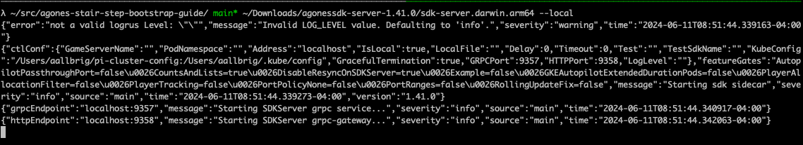

## June 11th 2024
The goal for today is to use the [Agones local development guide](https://agones.dev/site/docs/guides/client-sdks/local/) to _get something going_ locally in my unity editor. Since my UnityNuGet issue/PR are still in flight, the plan is to manually download C# Agone Game Server Client SDK directly from [its NuGet package location](https://www.nuget.org/packages/AgonesSDK) into a newly created unity project. I find it nice that one can get started developing without having to have a kubernetes cluster in the mix, at least yet.

The local dev guide has a download link for the agonessdk-server, but looks like its the same as what can be found in googleforgames/agones (link to [1.41.0 release](https://github.com/googleforgames/agones/releases/tag/v1.41.0)). Just for giggles here's the command sequence one can run to download into `~/Downloads` folder using `gh`:
```bash
zip_url=$(gh release view --repo googleforgames/agones --json assets --jq '.assets[] | select(.name | contains("agonessdk-server-")) | .url')
zip_name=$(basename $zip_url)
unzip_folder_name=$(basename $zip_name .zip)
curl -L $zip_url -o $HOME/Downloads/$zip_name
unzip $HOME/Downloads/$zip_name -d $HOME/Downloads/$unzip_folder_name
```
__Note: you can use `gh release list --repo googleforgames/agones` to view all releases using GitHub cli__

For me on my M2 MBP I can now start the server using `~/Downloads/agonessdk-server-1.41.0/sdk-server.darwin.arm64 --local` command.



---

Idle thoughts: I wonder how many projects I can find on GitHub that uses Agones. I wonder if I can spot folks talking about Agones on related Unity discord servers. Will probably explore that later.

## June 10th 2024
Sought guidance on how to use Agones. Had these three guides highlighted to me:
- https://agones.dev/site/docs/guides/client-sdks/local/
- https://agones.dev/site/docs/guides/local-game-server/
- https://agones.dev/site/docs/installation/creating-cluster/minikube/

I asked about the devx of how to bootstrap in what I call a "stair step" way. Basically, instead of even worrying about doing stuff inside kubernetes we use a software program that simulates the Agones platform. This is a practical solution that enables rapid development. Nice.

I like using xoofx/UnityNuGet. I noticed there wasn't the AgonesSDK in the registry. I open [issue #375](https://github.com/xoofx/UnityNuGet/issues/375) on the project before submitting [PR #376](https://github.com/xoofx/UnityNuGet/pull/376) to add Agones [C# Game Server Client SDK](https://agones.dev/site/docs/guides/client-sdks/csharp/) to the UnityNuGet registry. Always feels good to contribute to open source.

---

The person who helped me in the Agones slack channel actually appeared on the [Kubernetes Podcast in 2018](https://kubernetespodcast.com/episode/026-agones/) to talk about Agones. Cool!
